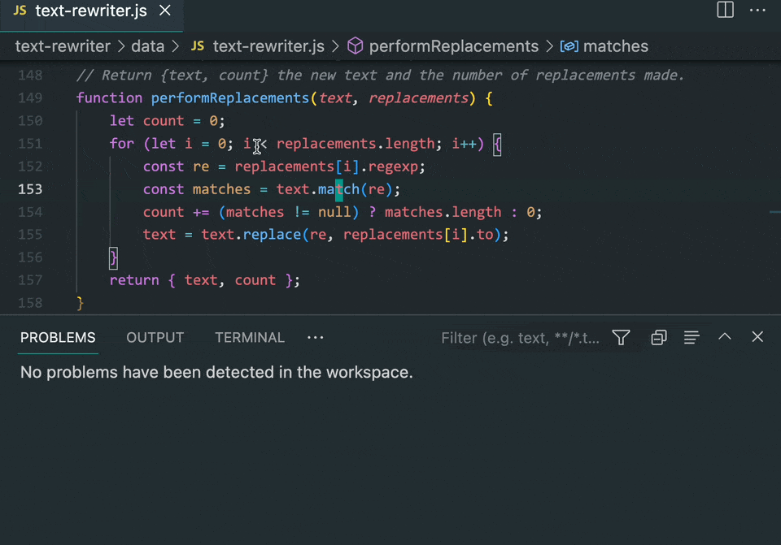
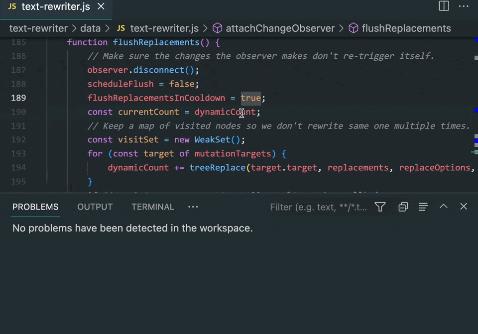

# Code Couplet

**A typechecker for your comments.**

A simple VS Code extension which checks that your code and comments are in sync.
Think of it as a typechecker for your comments.

## Usage

Code Couplet itself is a Node program which reads a stored description of code-comment relationships and verifies the codebase against these relationships.
These are stored in a `.code-couplet` folder in the root of your repository.
_Commit this folder into version control._

Currently Code Couplet is a [VS Code extension](vscode-extension/).

### VS Code

The VS Code extension for Code Couplet provides a quick way to link comments with code.
Hovering over a linked comment will show the code it is linked to, and vice versa.

It also shows diagnostic errors when the code and comments are out of sync.
These errors can include quick fixes to update the saved link automatically.

## Schema

Schema is defined in Typescript and encoded/decoded using io-ts with JSON serialization.
See [`src/schema.ts`](src/schema.ts).

## Future Plans

- Command line interface
- Git pre-commit hook
- Continuous integration job
